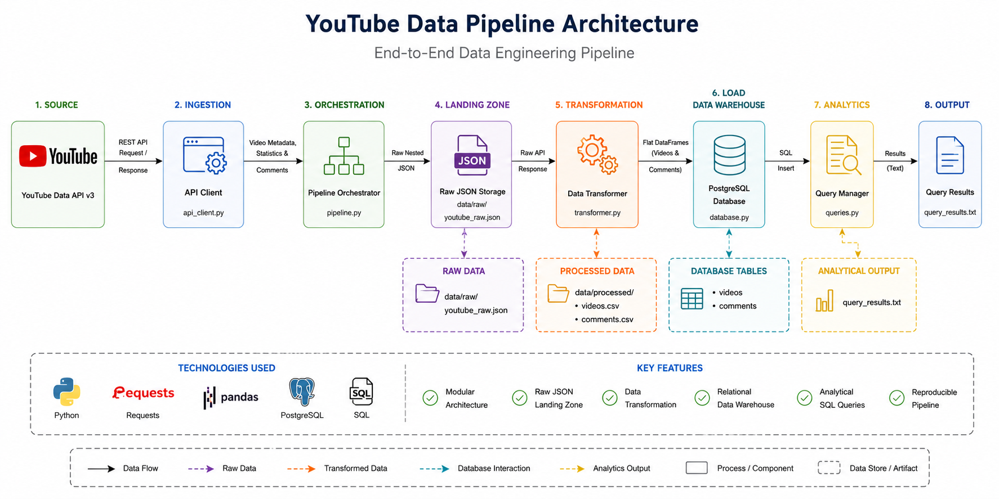

# YouTube Data Pipeline

**Architecture Diagram**




## Overview

This project is a solution for the **Junior Data Engineer Take-Home Assessment**.

The pipeline extracts data from the **YouTube Data API v3**, transforms the raw JSON into an analysis-ready format, stores the data in **PostgreSQL**, and executes analytical SQL queries.

The solution follows an object-oriented design where each component has a single responsibility, making the code modular, maintainable, and easy to extend.

---

# Technologies Used

* Python 3.x
* YouTube Data API v3
* PostgreSQL
* pandas
* requests
* psycopg2
* python-dotenv

---

# Project Structure

```text
youtube-data-pipeline/
│
├── src/
│   ├── api_client.py
│   ├── pipeline.py
│   ├── transformer.py
│   ├── database.py
│   ├── queries.py
│   └── main.py
│
├── data/
│   ├── raw/
│   └── processed/
│
├── database/
│   └── schema.sql
│
├── diagrams/
│   └── architecture.png
│
├── logs/
│   └── pipeline.log
│
├── .env.example
├── requirements.txt
├── README.md
└── design_notes.md
```

---

# Pipeline Workflow

The pipeline consists of five main stages:

1. Fetch videos from the YouTube Data API.
2. Retrieve statistics and comments for each video.
3. Save the raw API response as JSON (Landing Zone).
4. Transform the nested JSON into flat tables.
5. Load the transformed data into PostgreSQL.
6. Execute analytical SQL queries.

Pipeline Flow:

```text
YouTube API
      │
      ▼
APIClient
      │
      ▼
Raw JSON (Landing Zone)
      │
      ▼
Transformer
      │
      ▼
Processed DataFrames
      │
      ▼
PostgreSQL
      │
      ▼
SQL Analytical Queries
```

---

# Setup Instructions

## 1. Clone the repository

```bash
git clone <repository_url>
cd youtube-data-pipeline
```

---

## 2. Create a virtual environment

Windows

```bash
python -m venv venv
```

Activate it

```bash
venv\Scripts\activate
```

---

## 3. Install dependencies

```bash
pip install -r requirements.txt
```

---

## 4. Create a PostgreSQL database

Example

```sql
CREATE DATABASE youtube_pipeline;
```

---

## 5. Create a `.env` file

```text
YOUTUBE_API_KEY=YOUR_API_KEY

DB_HOST=localhost
DB_PORT=5432
DB_NAME=youtube_pipeline
DB_USER=postgres
DB_PASSWORD=your_password
```

---

# Running the Project

Run the application:

```bash
python src/main.py
```

The pipeline will automatically:

* Fetch YouTube videos
* Retrieve statistics
* Retrieve comments
* Save the raw JSON
* Transform the data
* Create PostgreSQL tables
* Load the data
* Execute analytical queries

---

# Output Files

After execution, the following files will be generated:

```
data/raw/youtube_raw.json

data/processed/videos.csv

data/processed/comments.csv

logs/pipeline.log

query_results.txt
```

---

# Database Schema

## videos

| Column        | Type         |
| ------------- | ------------ |
| video_id      | VARCHAR(50)  |
| title         | TEXT         |
| channel       | VARCHAR(255) |
| publish_date  | TIMESTAMP    |
| view_count    | BIGINT       |
| like_count    | BIGINT       |
| comment_count | BIGINT       |

---

## comments

| Column       | Type         |
| ------------ | ------------ |
| comment_id   | SERIAL       |
| video_id     | VARCHAR(50)  |
| author       | VARCHAR(255) |
| comment      | TEXT         |
| publish_date | TIMESTAMP    |

The `video_id` column in the `comments` table is a foreign key referencing the `videos` table.

---

# Why PostgreSQL?

PostgreSQL was selected because the transformed data is highly structured and naturally fits a relational model. Separating videos and comments into two related tables avoids data duplication and allows efficient SQL queries through primary and foreign key relationships. PostgreSQL also provides strong support for indexing, constraints, and analytical queries.

For significantly larger datasets or unstructured documents, another storage solution such as MongoDB or a distributed data warehouse could also be considered.

---

# Analytical Queries

The project includes three analytical SQL queries:

### 1. Top 10 videos by view count

Returns the ten most viewed videos.

---

### 2. Average views per channel

Calculates the average number of views for each channel.

---

### 3. Videos published during the last 30 days

Returns recently published videos ordered by publication date.

The output of these queries is saved to:

```
query_results.txt
```

---

# Error Handling

The application includes basic error handling for:

* HTTP request failures
* API timeouts
* Invalid responses
* Missing statistics
* Missing comments
* Database insertion failures

Errors are logged without stopping the entire pipeline whenever possible.

---

# Object-Oriented Design

The application is divided into multiple classes with clear responsibilities.

### APIClient

Handles communication with the YouTube Data API.

### Pipeline

Coordinates the entire workflow.

### Transformer

Converts nested JSON into analysis-ready tables.

### DatabaseManager

Creates database tables and inserts transformed data into PostgreSQL.

### QueryManager

Executes analytical SQL queries against PostgreSQL.

---

# Requirements

```
requests
pandas
psycopg2-binary
python-dotenv
```

---

# Future Improvements

Possible future enhancements include:

* API pagination for larger datasets
* Automatic retry logic for failed requests
* Unit testing
* Docker containerization
* Scheduling using Apache Airflow
* Parallel API requests for improved performance
* Data validation using schema enforcement
